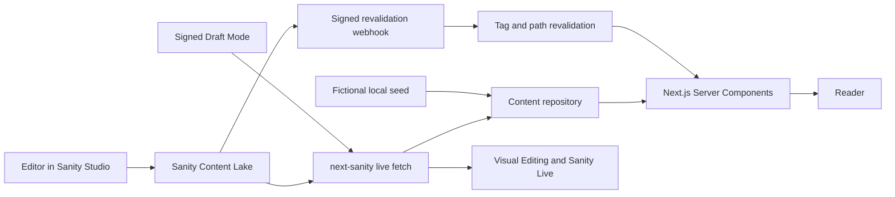

# Architecture

## System boundary

GlobHub has two connected surfaces:

1. The Next.js public application renders editorial, multimedia, service and
   corporate routes.
2. Sanity Content Lake and the embedded Studio at `/studio` provide structured
   content, workflow and website management.

The public app is deliberately read-only toward Sanity. Mutations happen in
Studio or a separately authenticated integration. Reader accounts, payments,
comment storage, email delivery and analytics are adapter boundaries, not fake
in-process services.

## Runtime design

The App Router defaults to React Server Components. Client components are used
only where browser state is necessary: the navigation disclosure, breaking
ticker controls, reading progress, share/copy actions, transcript disclosure,
recent searches, live timeline controls and forms.

`lib/content/repository.ts` is the public data boundary. It:

- calls centralized, parameterized GROQ queries;
- applies stable tags to CMS reads;
- returns typed domain objects;
- falls back to fictional local content when Sanity is not configured or
  temporarily unavailable;
- normalizes pagination and search filters in one place.

The fallback makes local development and review reliable, but production
monitoring should alert on the logged CMS failure instead of silently treating
fallback content as live publication data.

## Data flow

## Caching and preview

Published queries use Sanity Live and content tags. Webhooks revalidate tags and
known route paths after editorial mutations. Draft Mode selects the draft
perspective only when a server-only read token exists, turns on Stega metadata,
and renders Visual Editing. The read token is shared with the browser only while
the live draft connection is enabled; it must therefore be a least-privilege
Viewer token.

## Schema strategy

Common concerns are reusable objects: editorial image metadata, SEO, workflow,
schedule, media embeds, rich body blocks and callouts. A canonical `story`
document handles editorial variants through `contentType`; separate document
types exist where lifecycle or fields materially differ: video, podcast,
episode, live event, fact check, newsletter, event, people, taxonomy,
commercial, corrections and site management.

This avoids nearly identical article schemas while keeping validation and
query projections predictable.

## Routes

Public route groups cover:

- Home, latest, news, category hierarchy, topics, tags and search
- Story, author, team, leadership, management, editorial board and department
- Video, watch-live, podcasts, audio, live blogs, fact checks and photo
- Newsletters, events and contact
- About, advertising, careers, policies, legal and governance pages
- RSS, category RSS, podcast RSS, sitemap, news sitemap and robots
- Draft Mode, revalidation and the embedded Studio

Story URLs use `/story/[slug]`. The prefix prevents collisions with corporate,
taxonomy and service routes while keeping migrations and canonical generation
simple. Editors manage retired paths with the Sanity `redirect` document; a
deployment adapter can materialize those records into host redirects.

## Failure modes

- A missing document calls `notFound()` and uses the branded 404 page.
- Route segments have loading UI and the root has a recovery error boundary.
- CMS errors are logged server-side and fall back during development.
- Invalid media URLs do not render an iframe.
- Unconfigured form providers return an honest non-success state.
- Invalid webhook payloads or secrets return bounded 4xx responses.

## Extension points

Production integrations should implement interfaces at the boundary:

- search index provider for large archives;
- authenticated reader account and entitlement service;
- moderated comment provider;
- email/newsletter delivery provider;
- secure tip submission service with encryption and retention policy;
- analytics/consent adapter;
- advertising decision service.

None of these should share Sanity editorial credentials or bypass Sanity roles.
